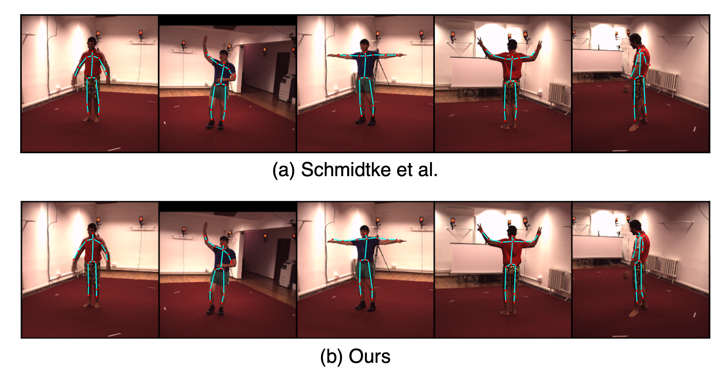

# Efficient, Self-Supervised Human Pose Estimation with Inductive Prior Tuning
[Paper](https://openaccess.thecvf.com/content/ICCV2023W/ROAD++/papers/Yoo_Efficient_Self-Supervised_Human_Pose_Estimation_with_Inductive_Prior_Tuning_ICCVW_2023_paper.pdf)



## Set up

1. In `configs/variables.py`, fill out `TO DO` elements.

2. Run the following commands.

```
conda create -n poseestimation python=3.7
conda install pytorch torchvision pytorch-cuda=11.6 -c pytorch -c nvidia
conda install -c anaconda notebook
conda install -c conda-forge matplotlib
pip install -r requirements.txt
```

## Dataset access

Request authors of Human3.6M dataset for access to dataset.

Once access is granted, the data should be structures as follows in the `data/` folder.

```
data
    -- S1
        -- videos
            --mp4 files
    -- S5
        -- videos
    -- S6
        -- videos
    ...
```

## Data preprocessing

```
cd code/preprocessing
python get_frames.py
python create_data_dict.py
python collect_frames_create_dirs.py
python collect_frames.py
python create_preprocessed_to_orig_mapping.py
```

## Train

Change directory to code/train: `cd code/train`

`python train_baseline.py -config ../../configs/baseline.yaml`

`python train_constrained.py -config ../../configs/constrained.yaml`

`python train_mse_flipaugment_twostepwarp.py -config ../../configs/mse_flipaugment_twostepwarp.yaml`
`python train_mse_flipaugment_twostepwarp.py -config ../../configs/mse_natural_flipaugment_twostepwarp.yaml`

`python train_mse_flipaugment.py -config ../../configs/mse_flipaugment.yaml`
`python train_mse_flipaugment.py -config ../../configs/mse_natural_flipaugment.yaml`

`python train_mse_twostepwarp.py -config ../../configs/mse_twostepwarp.yaml`

`python train_mse.py -config ../../configs/mse_natural.yaml`
`python train_mse.py -config ../../configs/mse.yaml`

`python train_baseline.py -config ../../configs/natural.yaml`

`python train_two_step_warp.py -config ../../configs/two_step_warp.yaml`

## Citation

```
@InProceedings{Yoo_2023_ICCV,
    author    = {Yoo, Nobline and Russakovsky, Olga},
    title     = {Efficient, Self-Supervised Human Pose Estimation with Inductive Prior Tuning},
    booktitle = {Proceedings of the IEEE/CVF International Conference on Computer Vision (ICCV) Workshops},
    month     = {October},
    year      = {2023},
    pages     = {3271-3280}
}
```